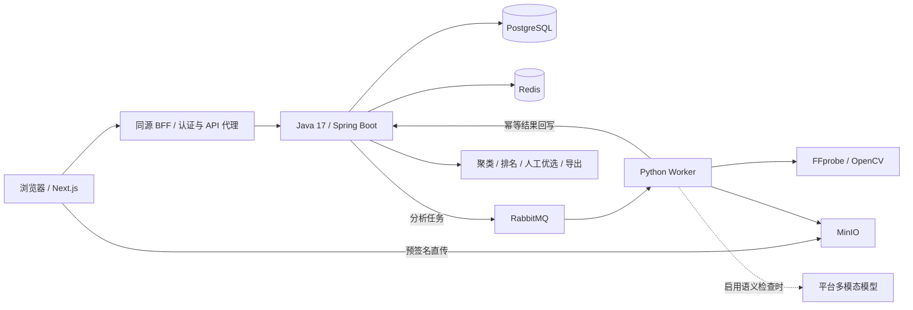

<div align="center">

# FrameFlow Select

**让批量视频质检有证据，让人工优选有依据。**

面向 AI 生成短视频的批量质检、问题定位、重复聚类与人工优选平台。

[功能与边界](#功能与边界) · [快速开始](#快速开始) · [系统架构](#系统架构) · [开发进度](#开发进度) · [验证与测试](#验证与测试) · [源码阅读](#源码阅读)

</div>

> **当前阶段：本地功能版 / 上线前验证阶段。** 核心业务链已实现，部署与运维工程已准备；远程生产部署、真实客户试点和价值验证尚未完成。本文描述当前源码能力，不代表生产可用承诺。开发主线为 [`frameflow-select/learning-main`](https://github.com/LJunP/FrameFlow/tree/frameflow-select/learning-main)。

## 为什么做这个项目

一次生成几十到几百条候选视频之后，团队仍需要逐条检查：视频是否损坏，时长和画质是否达标，有没有黑帧或冻结，是否符合创作要求，以及哪些候选其实高度重复。

FrameFlow Select 把这件事组织成一条可追溯流程：**冻结质检标准 → 上传候选 → 自动检查 → 查看证据 → 聚类排名 → 人工调整 → 锁定并导出**。每条问题关联具体检测器、规则、证据和适用的时间码，机器建议与人工决定分别保存。

项目同时是一套学习驱动的全栈工程：由 AI Agent 协助实现，项目所有者通过带核心注释的源码、测试和功能导读学习开发技术。优先顺序是 **掌握技术 → 产品真实可用 → 求职展示**；已有代码或合成测试不等于生产实践经历。

## 一次完整的使用流程

1. **注册并进入团队工作区**，创建项目。
2. **发布 Brief**：保存本批视频的创作要求；每次发布形成不可变快照。
3. **创建质检标准**：设置时长、分辨率、帧率等规则；按需启用平台配置的多模态模型。
4. **创建批次并上传**：批次固定引用 Brief 和质检标准的具体版本。
5. **关闭批次、触发分析**：Worker 从消息队列消费任务并回写结果。
6. **查看候选证据**：播放视频，查看确定性与语义检查结果，按时间码定位问题。
7. **生成排名和 Top-K 优选集**：检查重复聚类、分数及排除原因，再人工纳入或排除候选。
8. **锁定并导出 JSON / CSV**：保留机器选择与人工调整的区别，形成可追溯结果。

它处理的是已有候选视频的质检与选择；**视频生成、自动剪辑、成片渲染和分发不在当前产品范围内**。

## 功能与边界

| 能力 | 当前已实现 | 使用边界 |
| --- | --- | --- |
| 用户认证 | 注册、登录、RS256 JWT、刷新令牌轮换、登出、当前账户信息 | 尚无找回密码、邮箱验证、资料与密码编辑界面 |
| 团队权限 | OWNER / OPERATOR / REVIEWER / VIEWER 角色检查，团队资源隔离，Owner 查看成员 | 尚无成员邀请、角色调整、移除成员和多团队切换 |
| 项目管理 | 项目创建、查询、修改、归档，乐观锁与分页 API | 前端覆盖主要创建与读取流程；并非每个管理 API 都已有完整界面 |
| Brief 与质检标准 | Brief 不可变快照、Quality Profile 版本化、输入校验、批次固定版本 | 历史版本不原地修改；Web 以发布 Brief、创建标准和选择标准为主 |
| 批次与上传 | 容量 1–300，关闭批次，历史批次入口，候选分页；直传与分片上传 API | Web 当前一次选一个文件，最多 32 MiB；大文件走分片 API，无 Web 分片、断点续传或批量拖放 |
| 上传入口校验 | 对象存在性、大小、媒体签名；异常证据与对账接口 | 入口签名检查不是完整解码，损坏容器仍由 Worker 深度探针识别 |
| 确定性质检 | FFprobe 元数据、时长/分辨率/帧率规则、黑帧/冻结检测 | 规则依配置执行；不等于覆盖全部视觉缺陷的专业质量评估 |
| 异步分析 | RabbitMQ、Publisher Confirm、条件状态迁移、幂等回写、死信查询与重放 | 数据库事务与 MQ 发布没有分布式原子提交；异常窗口依赖重试、死信与运维处置 |
| AI 语义检查 | 创作要求对齐、整体观感、策略违规三类语义结果；Chat Completions / Responses 适配 | 模型需平台配置与有效凭据；最多 3 张关键帧，不保证覆盖全片所有瞬间 |
| 平台模型选择 | 安全模型目录、启用白名单、Profile 固定 modelId、Worker 路由 | 用户选择平台提供的模型；密钥由运维配置，不在网页填写或返回 |
| 聚类与排名 | SHA-256 精确重复、dHash 近重复、资格门、加权评分、排名快照 | 相似度阈值与分数不是未经真实数据验证的质量保证 |
| 人工优选与导出 | Top-K、INCLUDE / EXCLUDE、机器/人工两列、DRAFT → LOCKED、JSON / CSV | 锁定不可逆；导出结构化选择结果，不打包或渲染成片 |
| Web 产品界面 | 首页、认证、工作台、项目、批次、候选审阅、优选、账户与团队只读页 | 已有响应式基础；不宣称所有浏览器和尺寸均完成兼容性验收 |
| 缓存与限流 | 批次进度缓存、写后失效、Redis 故障降级、登录限流 | 缓存只优化统计；读取前仍校验当前用户权限 |
| 部署与运维 | 三个应用镜像、多环境 Compose、Nginx/HTTPS 模板、CI、晋级/回滚脚本；指标、日志、告警、备份恢复与故障演练工具 | 本地工程已交付；远程部署与生产运维验收未完成 |
| 试点工具 | 合成媒体生成、intake 校验、人工标注协议、指标统计、双格式报告 | 真实客户数据、双人盲评和价值结论尚未执行 |

### 如何理解结果

- `ANALYZED`：分析完成，未触发需要淘汰或人工复核的结果。
- `AUTO_REJECT`：确定性阻断规则不通过。
- `REVIEW_REQUIRED`：存在需要人工判断的结果；AI 语义判断不能直接充当确定性淘汰依据。
- `ANALYSIS_ERROR`：系统或分析过程异常，**不能解释成视频质量不合格**。
- `INVALID`：上传入口校验失败或上传会话失效。

最终判断仍需人工负责，尤其是语义、策略合规和创作质量。排名快照与锁定优选集帮助复查决策依据。

## 系统架构



- **Java 是业务与权限入口**：认证、领域状态、配置版本、任务派发、结果持久化、排名与导出。
- **PostgreSQL 是事实源**：Redis 可失效重建；媒体字节保存在 MinIO。
- **Worker 负责媒体计算与模型适配**：由 MQ 解耦耗时分析，内部回写使用独立鉴权。
- **浏览器不经 Java 转发视频字节**：通过短时效预签名 URL 直传对象存储。
- **认证凭据分层**：access token 只在前端内存，refresh token 使用 HttpOnly Cookie；Provider Key 只注入 Worker。

| 层 | 技术 |
| --- | --- |
| 后端 | **JDK 17**、Spring Boot 3.4.5、Maven Wrapper、MyBatis、Flyway、Spring Security |
| 数据与中间件 | PostgreSQL 16、Redis、RabbitMQ、MinIO |
| 分析 Worker | Python 3.11 基线、FFmpeg / FFprobe、OpenCV、NumPy |
| Web | Next.js 15、React 19、TypeScript 5、Node.js 22 |
| 运维 | Docker Compose、Nginx、GitHub Actions、Prometheus、Grafana、Loki、Alloy、Alertmanager |

精确依赖与镜像版本以 `pom.xml`、各组件 lockfile 及 Compose 为准；JDK 的 `[17,18)` 约束由构建强制执行。

## 快速开始

### 方式一：完整本地 Docker 栈（推荐）

需要 Git、运行中的 Docker Engine / Docker Desktop 和支持 `env_file.required` 的 Docker Compose v2。首次构建需要网络和足够的镜像空间。本机端口须空闲：3000、18080、54329、6379、5672、15672、9000、9001；可通过本地环境文件调整。

```bash
git clone --branch frameflow-select/learning-main https://github.com/LJunP/FrameFlow.git
cd FrameFlow

# 首次初始化；已有本地配置时不要覆盖。
cp -n infra/local/env.example infra/local/.env
infra/scripts/check-env-isolation.sh --environment local --env-file infra/local/.env

docker compose --env-file infra/local/.env \
  -f infra/local/docker-compose.yml up -d --build

infra/scripts/smoke-test.sh --environment local \
  --compose-file infra/local/docker-compose.yml --env-file infra/local/.env \
  --base-url http://127.0.0.1:3000
```

打开 **http://127.0.0.1:3000**，注册一个本地测试账户。API 默认在 **http://127.0.0.1:18080**。使用示例配置对应的 `127.0.0.1` 地址，避免与 `localhost` 混用导致 Cookie / 对象存储 CORS 不一致。

首次体验先**关闭质检标准中的 AI 语义检查**，用合成视频跑通确定性链路。默认配置没有真实 Provider Key；启用语义但没有有效配置时会显式报错，不会用 Fake 结果冒充真实模型。

查看状态与日志、停止服务：

```bash
docker compose --env-file infra/local/.env -f infra/local/docker-compose.yml ps
docker compose --env-file infra/local/.env -f infra/local/docker-compose.yml logs --tail=100 app worker web
docker compose --env-file infra/local/.env -f infra/local/docker-compose.yml down
```

`down` 保留命名卷。示例凭据只供 loopback 本地开发，不能用于公网部署。详细配置见 [local 运行说明](infra/local/README.md) 和 [部署导读](docs/guides/F9-源码导读.md)。

### 方式二：源码开发与测试

需要 **JDK 17、Python 3.11、Node.js 22**；Java 集成测试仍需要 Docker，宿主运行 Worker 还需要 FFmpeg / FFprobe。依赖安装使用现有 lockfile，不需要全局 Maven。

```bash
# 在仓库根目录验证后端：Testcontainers 自动创建隔离测试中间件。
./mvnw -B -q verify

# 初始化 Python 环境。
python3.11 -m venv frameflow-ai-worker/.venv
frameflow-ai-worker/.venv/bin/python -m pip install -r frameflow-ai-worker/requirements-dev.lock
frameflow-ai-worker/.venv/bin/python -m pip install --no-deps -e frameflow-ai-worker
frameflow-ai-worker/.venv/bin/python -m pytest frameflow-ai-worker/tests -q

# 前端校验。
npm --prefix frameflow-web ci
npm --prefix frameflow-web run test:contracts
npm --prefix frameflow-web run typecheck
npm --prefix frameflow-web run build
```

`npm --prefix frameflow-web run dev` 仅启动前端，不能代替 Java、Worker 和中间件。前端开发与生产构建分别使用 `.next-dev`、`.next`，避免互相覆盖。

### 可选：真实模型

阅读 [F6.1 模型选择导读](docs/guides/F6.1-源码导读.md) 和 [真实 Provider 门禁](docs/guides/F6-真实Provider门禁.md)，配置平台模型目录及 Worker 专属凭据。目录只含公开元数据与环境变量名；密钥不进入 Git、前端、Java 或证据报告。

真实调用涉及供应商计费和数据传输，应先使用合成素材与明确请求预算。已有一次测试通过不代表任何后续模型、账号或供应商都已验证。

## 开发进度

**当前源码版本线为 0.1.0；它是开发版本，不是已完成生产验收的正式稳定版。** 不用一个百分比混合“代码写完”“本地测过”“客户使用有效”三件不同的事。

| 阶段 | 已完成的工作 | 尚未完成的工作 |
| --- | --- | --- |
| F1–F5 基础主链 | 认证、项目与配置、上传、异步确定性质检、缓存与限流 | 持续回归与真实负载验证 |
| F6 / F6.1 AI | 两类协议适配、模型选择、语义证据、离线评测；已有真实模型参与的合成产品链证据 | 真实客户素材下的准确率、成本和长期稳定性验证 |
| F7–F8 优选与 Web | 聚类排名、人工优选、锁定导出、主要业务界面 | Web 分片/续传/批量上传、完整管理界面等仍未实现 |
| F12 品牌与账户团队基础 | 首页、导航、认证体验、账户和团队只读界面 | 所有者验收；完整账户编辑及团队管理能力 |
| F9 部署 | 本地镜像、Compose、CI 与远程发布脚本 | 远程 Registry / VPS / DNS / HTTPS 发布与回滚验收 |
| F10 运维 | 监控、日志、告警、备份、隔离恢复与本地故障演练工具 | 生产告警触达、异机恢复、真实规模 RTO / RPO 验证 |
| F11 试点 | 数据清单、标注协议、报告工具与合成彩排 | 真实客户批次、真实人工审核、效果与价值结论 |

**下一阶段顺序：当前源码回归与所有者验收 → 远程部署验证 → 生产运维演练 → 真实客户试点 → 根据数据改进。** 服务器购买、SSH、DNS 与生产发布由所有者执行；Agent 准备配置与指引。

上述未实现的功能是透明列出的缺口，不自动构成全部必须新增的承诺；后续范围由所有者按试点价值决定。唯一细化进度源为 [PROGRESS.md](.learning/PROGRESS.md)，学习状态由所有者本人维护。

## 验证与测试

测试分别覆盖 Java 业务/权限/真实中间件、Worker 检测与模型协议、Web 契约/构建和完整产品链。**构建成功不等于无 Bug；合成链路通过不等于生产或客户验证通过。**

- 当前修复范围、验证结果与剩余边界：[2026-09-13 修复记录](docs/evidence/2026-09-13-bugfix-review.md)。
- 历史真实 Provider 合成链路：[2026-08-25 E2E 证据](docs/evidence/f6-real-provider-full-e2e-opencode-luna-2026-08-25-retry/README.md)，39 项检查，1 次模型请求；仅代表当次运行。
- 可复现确定性链路：[夹具与门禁说明](experiments/fixtures/pre-f9-correctness/README.md)。
- 本地运维证据：[F9 部署](docs/evidence/F9-本地部署门禁报告.md)、[F10 运维](docs/evidence/F10-本地验证报告.md)。

`.github/workflows/ci.yml` 包含 Java、Worker、Web、部署与运维配置检查、镜像构建。Registry 推送需要手动工作流输入及对应环境授权，不会因普通源码 push 自动部署生产。

## 源码阅读

```text
FrameFlow/
├── frameflow-app/         Java 业务、权限、SQL 映射、迁移与测试
├── frameflow-ai-worker/   媒体检测、模型适配、消息消费与离线评测
├── frameflow-web/         Next.js 页面、同源代理与前端契约测试
├── infra/                环境模板、镜像、部署、监控、备份和故障工具
├── scripts/              合成媒体、产品门禁与试点工具
├── tests/pilot/          试点报告与统计校验
├── experiments/fixtures/ 可复现的合成测试输入定义
├── docs/                 产品、架构、路线、API、源码导读与证据
└── .learning/            开发与学习进度
```

建议先读 [产品与领域设计](docs/01-产品与领域设计.md)，再读 [技术架构](docs/02-技术架构与技术栈.md) 与 [开发学习路线](docs/03-开发与学习路线.md)。然后沿以下功能顺序阅读源码：

[F1 认证](docs/guides/F1-源码导读.md) → [F2 配置](docs/guides/F2-源码导读.md) → [F3 上传](docs/guides/F3-源码导读.md) → [F4 分析](docs/guides/F4-源码导读.md) → [F5 缓存](docs/guides/F5-源码导读.md) → [F6 AI](docs/guides/F6-源码导读.md) → [F6.1 模型](docs/guides/F6.1-源码导读.md) → [F7 优选](docs/guides/F7-源码导读.md) → [F8 Web](docs/guides/F8-源码导读.md) → [F12 账户与团队](docs/guides/F12-源码导读.md) → [F9 部署](docs/guides/F9-源码导读.md) → [F10 运维](docs/guides/F10-源码导读.md) → [F11 试点](docs/guides/F11-源码导读.md)。

核心源码使用 `★ 核心：` 注释说明“做什么、为什么、改坏会怎样”。API 入口与语义见 [OpenAPI 契约](docs/api/frameflow-v1.yaml)。

## 反馈、贡献与许可

报告问题时请提供：源码提交、运行方式、复现步骤、期望/实际行为和脱敏日志。请勿在 Issue、PR 或截图中提交 Provider Key、访问令牌、预签名 URL、真实客户媒体或个人信息。

修改应保持 JDK 17 基线、历史迁移不可变、团队权限隔离、机器/人工决定分离及 `ANALYSIS_ERROR` 语义；相关回归通过后再提交。开发主线为 `frameflow-select/learning-main`；`main` 与 `archive/frameflow-select-agent-mvp-v1` 是冻结历史，不应当作最新开发入口。

**当前仓库尚未提供 LICENSE 文件。** 公开源码不等于已授予开源使用、修改或分发许可；许可证选择由项目所有者另行决定。本文不擅自声明 MIT、Apache-2.0 等许可。
