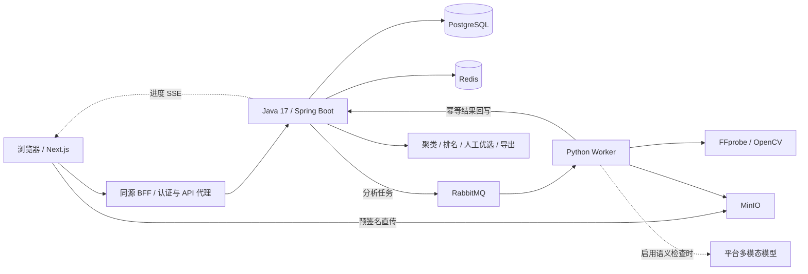

<div align="center">

# FrameFlow Select

**让批量视频质检有证据，让人工优选有依据。**

面向 AI 生成短视频的批量质检、问题定位、重复聚类与人工优选平台。

[](#项目阶段)
[](#技术栈)
[](#技术栈)
[](#技术栈)
[](#技术栈)
[](#许可)

[产品定位](#产品定位) · [功能总览](#功能总览) · [系统架构](#系统架构) · [快速开始](#快速开始) · [项目阶段](#项目阶段) · [API 概览](#api-概览) · [验证与测试](#验证与测试) · [源码阅读](#源码阅读)

</div>

---

> ### 当前阶段：本地功能版 / 上线前验证阶段
>
> 核心业务链（F1–F8、F6.1、F12）已实现并通过本地回归；F9–F11 的**本地工程与动态门禁**已交付。
> **远程生产部署、production 运维验收、真实客户试点与价值结论尚未执行。**
>
> 本文描述当前源码的真实能力，不构成生产可用承诺。开发主线为 `main`。

---

## 产品定位

一次生成几十到几百条候选视频之后，团队仍要逐条检查：视频是否损坏，时长与画质是否达标，有没有黑帧或冻结，是否符合创作要求，以及**哪些候选其实高度重复**。

FrameFlow Select 把这件事组织成一条可追溯流程：

```text
冻结质检标准 → 上传候选 → 自动检查 → 查看证据 → 聚类排名 → 人工调整 → 锁定并导出
```

每条问题都关联具体检测器、规则、证据和适用时间码；**机器建议与人工决定分别保存**，事后可复盘。

**核心价值底线：减少人工完整观看量的同时，尽量避免错误淘汰真正优秀的视频。**
宁可多送几条进人工复核，也不让机器无证据地杀掉好视频。

### 目标用户

- 批量生成 AI 电商短视频的个人创作者
- AI 内容工作室、电商广告素材团队
- 小型 MCN 与 AI 视频生成服务团队

### 明确不做（非目标）

不生成视频 · 不做浏览器内剪辑 · 不自动发布 · 不预测爆款 · 不替代最终人工审核 ·
不做通用内容安全审核平台 · 不做通用 Agent 平台 · 不训练视频生成基础模型。

> 本项目处理**已有候选视频**的质检与选择；视频生成、自动剪辑、成片渲染与分发不在范围内。

## 功能总览

### 一次完整的使用流程

1. **注册并进入团队工作区**，创建项目。
2. **发布 Brief**：保存本批视频的创作要求；每次发布形成不可变快照。
3. **创建质检标准**：设置时长、分辨率、帧率等规则；按需启用平台配置的多模态模型。
4. **创建批次并上传**：批次固定引用 Brief 与质检标准的具体版本。
5. **关闭批次、触发分析**：Worker 从消息队列消费任务并回写结果。
6. **查看候选证据**：播放视频，查看确定性与语义检查结果，按时间码定位问题。
7. **生成排名与 Top-K 优选集**：检查重复聚类、分数与排除原因，再批量纳入或排除候选。
8. **锁定并导出 JSON / CSV**：保留机器选择与人工调整的区别，形成可追溯结果。

### 能力与边界

| 能力 | 当前已实现 | 使用边界 |
| --- | --- | --- |
| **用户认证** | 注册、登录、RS256 JWT、刷新令牌轮换、登出、当前账户信息、**昵称编辑**、**密码修改（改后吊销全部会话）**、**自助找回密码（令牌哈希、一次性核销）** | 尚无邮箱验证；找回密码尚未接入 SMTP，本地从服务日志取令牌 |
| **团队权限** | OWNER / OPERATOR / REVIEWER / VIEWER 角色检查，团队资源隔离，成员列表，**成员邀请（一次性链接、令牌哈希）**、**撤销未接受邀请**、**角色调整**、**移除成员** | 尚无多团队切换 UI、所有权转移、邀请邮件自动发送（需手工转发链接） |
| **项目管理** | 项目创建、查询、修改、归档，乐观锁与分页 API | 前端覆盖主要创建与读取流程；并非每个管理 API 都已有完整界面 |
| **Brief 与质检标准** | Brief 不可变快照、Quality Profile 版本化、输入校验、批次固定版本 | 历史版本不原地修改 |
| **批次与上传** | 容量 1–300、关闭批次、**历史批次分页**、候选分页；**浏览器单文件 ≤200 MiB，>32 MiB 自动分片并发上传**；**多文件选择与拖放排队直传** | 尚无断点续传 |
| **上传入口校验** | 对象存在性、大小、媒体签名；异常证据与对账接口 | 入口签名检查不是完整解码，损坏容器仍由 Worker 深度探针识别 |
| **确定性质检** | FFprobe 元数据、时长/分辨率/帧率规则、黑帧/冻结检测 | 规则依配置执行；不等于覆盖全部视觉缺陷的专业质量评估 |
| **异步分析** | RabbitMQ、Publisher Confirm、条件状态迁移、幂等回写、死信查询与重放；**进度 SSE 实时推送（失败自动回退轮询）** | 数据库事务与 MQ 发布没有分布式原子提交；异常窗口依赖重试、死信与运维处置 |
| **AI 语义检查** | 创作要求对齐、整体观感、策略违规三类语义结果；Chat Completions / Responses 双协议适配 | 模型需平台配置与有效凭据；最多 3 张关键帧，不保证覆盖全片所有瞬间 |
| **平台模型选择** | 安全模型目录、启用白名单、Profile 固定 modelId、Worker 路由、Worker-only 密钥注入 | 用户选择平台提供的模型；密钥由运维配置，不在网页填写或返回 |
| **聚类与排名** | SHA-256 精确重复、dHash 近重复、资格门、加权评分、排名快照 | 相似度阈值与分数不是未经真实数据验证的质量保证 |
| **人工优选** | Top-K、INCLUDE / EXCLUDE、机器/人工两列、**批量收录/剔除**、DRAFT → LOCKED | 锁定不可逆 |
| **导出** | JSON / CSV，**中文表头 + UTF-8 BOM**，含文件名/状态/大小/得分/**机器入选**/**簇编号**/质检结论/人工动作/时间戳，文件名带日期 | 导出结构化选择结果，不打包或渲染成片 |
| **Web 界面** | 公开首页、认证、工作台、项目、批次、候选审阅、优选、账户与团队；**全局搜索**、**Toast 通知**、**空状态引导**、**移动端抽屉滑动手势**；液态玻璃视觉与鼠标跟随动效 | 不宣称所有浏览器和尺寸均完成兼容性验收 |
| **候选审阅播放器** | 倍速（0.25x–2x）、逐帧步进、毫秒级时间码、截图导出 PNG、全屏、键盘快捷键、Finding 时间码跳转 | 全屏能力受宿主策略限制，失败时显式提示 |
| **缓存与限流** | 批次进度缓存、写后失效、Redis 故障降级、登录限流 | 缓存只优化统计；读取前仍校验当前用户权限 |
| **部署与运维** | 三个应用镜像、多环境 Compose、Nginx/HTTPS 模板、CI、晋级/回滚脚本；指标、日志、告警、备份恢复与故障演练工具 | 本地工程已交付；远程部署与生产运维验收未完成 |
| **试点工具** | 合成媒体生成、intake 校验、人工标注协议、指标统计、双格式报告 | 真实客户数据、双人盲评和价值结论尚未执行 |

### 如何理解分析结果

| 状态 | 含义 |
| --- | --- |
| `ANALYZED` | 分析完成，未触发需要淘汰或人工复核的结果 |
| `AUTO_REJECT` | 确定性阻断规则不通过（**仅确定性维度可触发，且必须带证据**） |
| `REVIEW_REQUIRED` | 存在需要人工判断的结果；AI 语义判断不能直接充当确定性淘汰依据 |
| `ANALYSIS_ERROR` | **系统或分析过程异常，不能解释成视频质量不合格** |
| `INVALID` | 上传入口校验失败或上传会话失效 |

最终判断仍需人工负责，尤其是语义、策略合规和创作质量。排名快照与锁定优选集帮助复查决策依据。

## 系统架构



**形态：模块化单体（Modular Monolith）+ 异步 Python Worker + 轻前端。** MVP 阶段明确不拆微服务。

- **Java 是业务与权限入口**：认证、领域状态、配置版本、任务派发、结果持久化、排名与导出。
- **PostgreSQL 是唯一事实源**：Redis 可失效重建；媒体字节保存在 MinIO。
- **Worker 负责媒体计算与模型适配**：由 MQ 解耦耗时分析，内部回写使用独立鉴权。
- **浏览器不经 Java 转发视频字节**：通过短时效预签名 URL 直传对象存储。
- **认证凭据分层**：access token 只在前端内存，refresh token 使用 HttpOnly Cookie；Provider Key 只注入 Worker。

### 技术栈

| 层 | 技术 |
| --- | --- |
| 后端 | **JDK 17**（构建硬锁 `[17,18)`）、Spring Boot 3.4.5、Maven Wrapper、MyBatis、Flyway、Spring Security 6 |
| 数据与中间件 | PostgreSQL 16、Redis 7、RabbitMQ 4、MinIO（S3 兼容） |
| 分析 Worker | Python 3.11、FFmpeg / FFprobe、OpenCV、NumPy、pika |
| Web | Next.js 15.5.25、React 19.1.0、TypeScript 5.8.3、Node.js 22 |
| 测试 | JUnit 5、Testcontainers、ArchUnit、pytest、OpenAPI 契约一致性测试、Node test runner |
| 运维 | Docker Compose、Nginx、GitHub Actions、Prometheus、Grafana、Loki、Alloy、Alertmanager |

MinIO 使用同一历史发布版本的官方 Quay 多架构固定摘要，避免 Docker Hub 镜像不可获取。
其[社区仓库已归档](https://github.com/minio/minio)，生产前还需评估安全维护与存储支持策略；本轮没有擅自更换对象存储技术。

精确依赖与镜像版本以 `pom.xml`、各组件 lockfile 及 Compose 为准。

### 关键技术决策

| 决策 | 理由 |
| --- | --- |
| PostgreSQL 为唯一事实源 | 字节在 MinIO、元数据在 PG，两者分离互相引用 |
| 分析必须异步 | 天然的耗时任务：批次调度 → MQ → Worker → 幂等回写；要求 Publisher Confirm、ACK、重试上限、DLQ 可重放 |
| Redis 只做可丢失的事 | 限流、热点缓存、进度缓存；宕机时业务降级但不中断，严禁业务事实只存 Redis |
| RabbitMQ 而非 Kafka | 任务分发型场景需要 ACK/路由/DLQ；单团队规模下 Kafka 是过度设计 |
| 对象存储用预签名直传 | 后端不转发视频字节；支持 SIMPLE 与 MULTIPART 两种模式 |
| AI 输出只是建议 | 模型结论必须带 Evidence 束，只进人工复核，永不自动淘汰；Provider 走 Adapter 可替换可 Mock |
| 模型平台托管、用户白名单选择 | Profile 版本固化 `modelId`；换实际模型必须发新 ID，保证历史证据可解释 |
| 明确不引入 K8s / Kafka / 微服务 / Service Mesh | "公司都在用"不构成理由，必须有本项目的真实瓶颈数据 |

## 快速开始

### 方式一：完整本地 Docker 栈（推荐）

需要 Git、运行中的 Docker Engine / Docker Desktop 和支持 `env_file.required` 的 Docker Compose v2。
本机端口须空闲：3000、18080、54329、6379、5672、15672、9000、9001；可通过本地环境文件调整。

```bash
git clone --branch main https://github.com/LJunP/FrameFlow.git
cd FrameFlow

# 首次初始化；已有本地配置时不要覆盖。
cp -n infra/local/env.example infra/local/.env
infra/scripts/check-env-isolation.sh --environment local --env-file infra/local/.env

docker compose --env-file infra/local/.env \
  -f infra/local/docker-compose.yml up -d --build

infra/scripts/smoke-test.sh --environment local \
  --compose-file infra/local/docker-compose.yml --env-file infra/local/.env \
  --base-url http://127.0.0.1:3000
```

打开 **http://127.0.0.1:3000**，注册一个本地测试账户。API 默认在 **http://127.0.0.1:18080**。
请统一使用 `127.0.0.1`，不要与 `localhost` 混用——否则 Cookie 域与对象存储 CORS 会不一致。

> **首次体验建议**：先**关闭质检标准中的 AI 语义检查**，用合成视频跑通确定性链路。
> 默认配置没有真实 Provider Key；启用语义但没有有效配置时会**显式报错**，不会用 Fake 结果冒充真实模型。

查看状态与日志、停止服务：

```bash
docker compose --env-file infra/local/.env -f infra/local/docker-compose.yml ps
docker compose --env-file infra/local/.env -f infra/local/docker-compose.yml logs --tail=100 app worker web
docker compose --env-file infra/local/.env -f infra/local/docker-compose.yml down
```

`down` 保留命名卷。示例凭据只供 loopback 本地开发，不能用于公网部署。
详见 [local 运行说明](infra/local/README.md) 与 [部署导读](docs/guides/F9-源码导读.md)。

**只把 Java 跑在宿主机时**（前端/Worker 用 Compose，后端用 IDE 或 `./mvnw`）：
在 `infra/local/.env` 里设置 `FRAMEFLOW_WORKER_API_BASE=http://host.docker.internal:18080`，
否则容器内的 Worker 会把 `127.0.0.1` 解析成自己，分析任务永远停在进行中。

### 方式二：源码开发与测试

需要 **JDK 17、Python 3.11、Node.js 22**；Java 集成测试仍需 Docker，宿主运行 Worker 还需 FFmpeg / FFprobe。

```bash
# 后端：Testcontainers 自动创建隔离测试中间件
./mvnw -B -q verify

# Worker
python3.11 -m venv frameflow-ai-worker/.venv
frameflow-ai-worker/.venv/bin/python -m pip install -r frameflow-ai-worker/requirements-dev.lock
frameflow-ai-worker/.venv/bin/python -m pip install --no-deps -e frameflow-ai-worker
frameflow-ai-worker/.venv/bin/python -m pytest frameflow-ai-worker/tests -q

# Web
npm --prefix frameflow-web ci
npm --prefix frameflow-web run test:contracts
npm --prefix frameflow-web run typecheck
npm --prefix frameflow-web run build
```

`npm --prefix frameflow-web run dev` 仅启动前端，不能代替 Java、Worker 和中间件。
前端开发与生产构建分别使用 `.next-dev`、`.next`，避免互相覆盖。

### 可选：接入真实模型

阅读 [F6.1 模型选择导读](docs/guides/F6.1-源码导读.md) 与 [真实 Provider 门禁](docs/guides/F6-真实Provider门禁.md)，配置平台模型目录及 Worker 专属凭据。
目录只含公开元数据与环境变量名；密钥不进入 Git、前端、Java 或证据报告。

真实调用涉及供应商计费与数据传输，应先用合成素材与明确请求预算。
**已有的历史测试通过，不代表任何后续模型、账号或供应商都已验证。**

## 项目阶段

**当前源码版本线为 0.1.0，是开发版本，不是已完成生产验收的正式稳定版。**
不用一个百分比混合"代码写完""本地测过""客户使用有效"这三件不同的事。

| 阶段 | 状态 | 说明 |
| --- | --- | --- |
| **P0 · 本地功能版** | ✅ 已完成 | F1–F8、F6.1、F12 全部交付，本地回归通过 |
| **P1 · 部署就绪（Deploy-ready）** | ⚠️ 本地工程完成 | 镜像、Compose、CI、Nginx/HTTPS 模板、晋级与回滚脚本齐备；**远程 Registry / VPS / DNS / HTTPS 发布未执行** |
| **P2 · 生产就绪（Production-ready）** | ⚠️ 本地演练完成 | 监控、日志、告警、备份与四类故障演练已在 local 通过；**production 告警触达、真实规模 RTO/RPO、异机恢复未执行** |
| **P3 · 试点就绪（Pilot-ready）** | ⚠️ 工程完成 | 试点方案、标注协议、指标与报告工具、合成彩排通过；**真实客户批次与真实人工审核未执行** |
| **P4 · 价值验证** | ⬜ 未开始 | 需要真实数据得出 `PILOT_VALUE_PROVEN` 或 `PILOT_NOT_PROVEN` |

### 功能进度（F1–F12）

| # | 功能 | 开发状态 | 尚未完成 |
| --- | --- | --- | --- |
| F1 | 工程基线与用户认证 | ✅ 已交付 | 邮箱验证、找回密码的 SMTP 投递 |
| F2 | 项目与质检配置 | ✅ 已交付 | — |
| F3 | 批次与视频上传 | ✅ 已交付 | 断点续传 |
| F4 | 确定性质检流水线 | ✅ 已交付 | Outbox 等跨系统一致性方案 |
| F5 | 缓存与限流（Redis） | ✅ 已交付 | 持续回归与真实负载验证 |
| F6 | 语义质检（AI Provider） | ✅ 已交付 | 真实客户素材下的准确率、成本与稳定性 |
| F6.1 | 平台多模型选择 | ✅ 已交付 | 更多供应商适配 |
| F7 | 聚类排名与 Top-K 优选 | ✅ 已交付 | 阈值与权重需真实数据校准 |
| F8 | Web 前端产品化 | ✅ 已交付 | 完整管理界面、浏览器兼容性验收 |
| F12 | 品牌前台与账户团队基础 | ✅ 回归完成，待所有者验收 | 多团队切换、所有权转移 |
| F9 | 服务器部署与 CI/CD | ⚠️ 本地工程已交付 | **VPS、SSH、DNS、HTTPS、远程 CI 发布与回滚验收** |
| F10 | 生产化运维 | ⚠️ 本地工程与演练已交付 | **production 外部告警、真实 RTO/RPO、异机恢复** |
| F11 | 真实试点验证 | ⚠️ Pilot-ready 已交付 | **真实客户批次、真实人工审核、价值结论** |

> F1–F12 代码写完了不等于项目做完了。后续范围由所有者按试点价值决定。
> 唯一细化进度源为 [PROGRESS.md](.learning/PROGRESS.md)，**学习状态由所有者本人维护**。

### 下一阶段顺序

```text
当前源码回归与所有者验收 → 远程部署验证（F9）→ 生产运维演练（F10）→ 真实客户试点（F11）→ 依据数据改进
```

服务器购买、SSH、DNS 与生产发布**由所有者亲手执行**；Agent 负责准备全部配置、脚本与逐步指引。

## API 概览

完整契约以 [OpenAPI 文档](docs/api/frameflow-v1.yaml) 为准，运行时与该契约由**双向一致性测试**强制锁定。

| 分组 | 端点 |
| --- | --- |
| 健康检查 | `GET /api/v1/ping` |
| 认证 | `POST /auth/register`、`/auth/login`、`/auth/refresh`、`/auth/logout`、`GET /me`、`POST /auth/password-reset/request`、`POST /auth/password-reset/confirm` |
| 账户 | `PUT /users/me/profile`、`PUT /users/me/password` |
| 团队与邀请 | `GET /teams/{id}/members`、`PUT /teams/{id}/members/{userId}/role`、`DELETE /teams/{id}/members/{userId}`、`GET|POST /teams/{id}/invitations`、`DELETE /teams/{id}/invitations/{invitationId}`、`POST /invitations/accept` |
| 项目与配置 | `GET|POST /projects`、`GET|PUT /projects/{id}`、`POST /projects/{id}/archive`、`GET /projects/{id}/batches`、`GET|POST /projects/{id}/briefs`、`GET /projects/{id}/briefs/current`、`GET|POST /quality-profiles`、`GET|POST /quality-profiles/{id}/versions`、`GET /semantic-models` |
| 批次与上传 | `POST /batches`、`GET /batches/{id}`、`POST /batches/{id}/close`、`GET /batches/{id}/progress`、**`GET /batches/{id}/events`（SSE）**、`GET|POST /batches/{id}/candidates`、`POST /batches/{id}/reconcile`、`POST /candidates/{id}/upload-parts`、`POST /candidates/{id}/complete`、`GET /candidates/{id}/content-url` |
| 分析与证据 | `POST /batches/{id}/analyze`、`GET /candidates/{id}/findings` |
| 排名与优选 | `POST /batches/{id}/rank`、`GET /batches/{id}/ranking/latest`、`GET|POST /batches/{id}/selections`、`GET /selections/{id}`、`POST /selections/{id}/items`、`POST /selections/{id}/lock`、`GET /selections/{id}/export?format=json\|csv` |
| 搜索 | `GET /search?q=&limit=`（项目 / 批次 / 候选分组，团队作用域） |
| 内部与运维 | `POST /internal/analysis-results`（Worker 回写，`X-Worker-Key`）、`GET /admin/mq/stats`、`POST /admin/mq/replay-dlq`（平台管理员密钥 `X-Admin-Key`，**不是**团队 OWNER） |

## 验证与测试

测试分别覆盖 Java 业务/权限/真实中间件、Worker 检测与模型协议、Web 契约/构建和完整产品链。

> **构建成功不等于无 Bug；合成链路通过不等于生产或客户验证通过。**

### 测试规模

| 范围 | 规模 | 时效 |
| --- | --- | --- |
| Java | 112 项（含越权负例、幂等、并发、契约、邀请全流程与架构边界） | 本次工作树实测 |
| Web | 19 项契约测试 + 类型检查 + 生产构建 | 本次工作树实测 |
| Worker + Pilot | 131 项（Worker 110 + Pilot 21，离线，无真实模型调用） | 2026-09-13 记录，本轮未重跑 |

### 本地端到端实测（当前工作树）

在新批次上用**真实上传与真实分析**跑通完整链路，连续两次结果一致：

```text
新建批次 → 上传真实 MP4（直传 HTTP 200）→ 确认 UPLOADED → 关闭批次
→ 触发分析 → 15 秒内 ANALYZED → 生成排名 → 创建优选集 → 锁定
→ 导出 CSV（中文表头 + 日期文件名）→ SSE 推送正常
```

### 证据与报告

- 当前修复范围、验证结果与剩余边界：[2026-09-13 修复记录](docs/evidence/2026-09-13-bugfix-review.md)
- 历史真实 Provider 合成链路：[2026-08-25 E2E 证据](docs/evidence/f6-real-provider-full-e2e-opencode-luna-2026-08-25-retry/README.md)（39 项检查、1 次模型请求；仅代表当次运行）
- 可复现确定性链路：[夹具与门禁说明](experiments/fixtures/pre-f9-correctness/README.md)
- 本地运维证据：[F9 部署](docs/evidence/F9-本地部署门禁报告.md) · [F10 运维](docs/evidence/F10-本地验证报告.md) · [F5 Redis 降级演练](docs/evidence/F5-redis-降级演练.md)

`.github/workflows/ci.yml` 覆盖 Java、Worker、Web、部署与运维配置检查、镜像构建。
**Registry 推送需要手动工作流输入与对应环境授权**，不会因普通源码 push 自动部署生产。

## 源码阅读

```text
FrameFlow/
├── frameflow-app/         Java 业务、权限、SQL 映射、迁移与测试
├── frameflow-ai-worker/   媒体检测、模型适配、消息消费与离线评测
├── frameflow-web/         Next.js 页面、同源代理与前端契约测试
├── infra/                 环境模板、镜像、部署、监控、备份与故障工具
├── scripts/               合成媒体、产品门禁与试点工具
├── tests/pilot/           试点报告与统计校验
├── experiments/fixtures/  可复现的合成测试输入定义
├── docs/                  产品、架构、路线、API、源码导读与证据
└── .learning/             开发与学习进度
```

建议阅读顺序：

1. [产品与领域设计](docs/01-产品与领域设计.md) —— 领域概念、状态机、质检模型（唯一产品事实源）
2. [技术架构与技术栈](docs/02-技术架构与技术栈.md) —— 选型理由与边界（唯一技术事实源）
3. [开发与学习路线](docs/03-开发与学习路线.md) —— 功能切片、任务分解与自测问题
4. 沿功能顺序读源码与导读：

[F1 认证](docs/guides/F1-源码导读.md) → [F2 配置](docs/guides/F2-源码导读.md) → [F3 上传](docs/guides/F3-源码导读.md) → [F4 分析](docs/guides/F4-源码导读.md) → [F5 缓存](docs/guides/F5-源码导读.md) → [F6 AI](docs/guides/F6-源码导读.md) → [F6.1 模型](docs/guides/F6.1-源码导读.md) → [F7 优选](docs/guides/F7-源码导读.md) → [F8 Web](docs/guides/F8-源码导读.md) → [F12 账户与团队](docs/guides/F12-源码导读.md) → [F9 部署](docs/guides/F9-源码导读.md) → [F10 运维](docs/guides/F10-源码导读.md) → [F11 试点](docs/guides/F11-源码导读.md)

核心源码使用 `★ 核心：` 注释说明「做什么、为什么这样设计、改坏会怎样」。API 入口与语义见 [OpenAPI 契约](docs/api/frameflow-v1.yaml)。

## 协作与开发红线

本项目由 Agent 实现全部代码并标注核心注释，所有者通过阅读源码掌握技术。优先顺序为
**掌握技术 → 产品真实可用 → 求职展示**；已有代码或合成测试不等于生产实践经历。

修改前请确认不触碰以下红线：

- 保持 **JDK 17** 基线（构建已硬锁 `[17,18)`，非 17 直接失败）
- **历史迁移不可变**，Flyway 只前向
- 保持**团队权限隔离**与**机器/人工决定分离**
- `ANALYSIS_ERROR` **严禁伪装成视频不合格**
- 不通过改阈值/测试/历史制造 PASS
- `PROJECT_COMPLETE` / `PILOT_VALUE_PROVEN` 只能由所有者依据数据批准

## 贡献与反馈

报告问题请提供：源码提交、运行方式、复现步骤、期望/实际行为与脱敏日志。

> **请勿**在 Issue、PR 或截图中提交 Provider Key、访问令牌、预签名 URL、真实客户媒体或个人信息。

修改应保持上述红线；相关回归通过后再提交。开发主线为 `main`（已解除冻结，作为唯一长期主线），
需要隔离开发时使用临时 `codex/<短名>` 分支，验证并合回 `main` 后清理。
历史分支归档记录见 [主线统一记录](docs/evidence/2026-09-13-main-consolidation.md)。

## 许可

**本仓库尚未提供 LICENSE 文件。** 公开源码不等于已授予开源使用、修改或分发许可；
许可证选择由项目所有者另行决定。本文不擅自声明 MIT、Apache-2.0 等许可。

---

<div align="center">

**FrameFlow Select** · 让批量视频质检有证据，让人工优选有依据

当前为开发版本（0.1.0-dev）· 未完成生产验收 · 未进行真实客户试点

</div>
